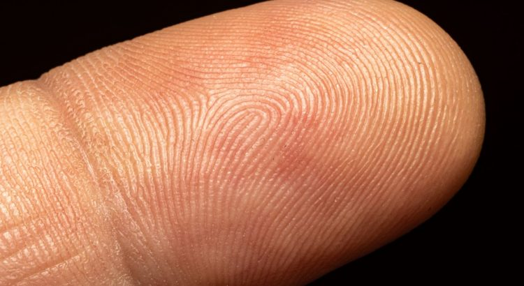
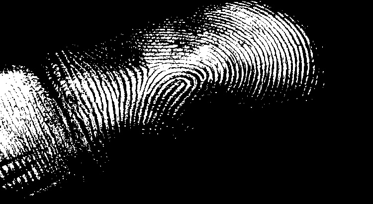
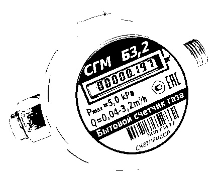
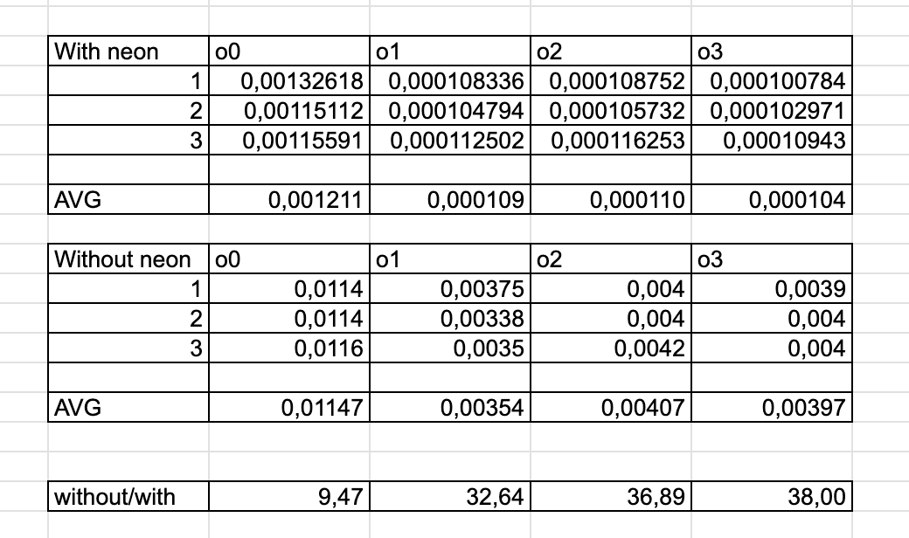

# Мобильные системы компьютерного зрения
## Лабораторная работа №3 (Вариант 3)
### Выполнили: Ганыс, Реккубрацкий, Сидуков
### Преподаватель Денисов А.К.


Цель работы:
Изучить основы оптимизации и векторизации алгоритмов компьютерного
зрения на базе процессорной системы ARM Cortex A57 MPCore + NEON.
(Бинаризация grayscale изображения с фиксированным порогом)

Задание:
1) Разработать программу на C++, реализующую задание в соответствии с
вариантом двумя способами: без использования векторных
инструкций и с ними. 
2) Оценить следующие характеристики:
- 2.1) Зависимость производительности при изменении размера
входных данных (размера изображения).
- 2.2) Зависимость производительности от уровня оптимизации (флаги
-O0, -O1, -O2, -O3) для варианта без векторных инструкций.
- 2.3) Влияние ручной векторизации алгоритма на
производительность. 

Отчёт должен содержать следующие пункты:
1) Теоретическая база
2) Описание разработанной системы (алгоритмы,принципы работы,
архитектура)
3) Результаты работы и тестирования системы(скриншоты,изображения,
графики, закономерности)
4) Выводы
5) Использованные источники

## Теоретическая база:
Бинаризация изображения в оттенках серого с фиксированным порогом — это метод преобразования градаций серого в бинарное изображение, где каждый пиксель становится либо черным (0), либо белым (1), в зависимости от значения яркости этого пикселя относительно заданного порога. Этот процесс используется для упрощения изображений и выделения объектов, уменьшения объемов данных и упрощения последующих вычислений в задачах анализа изображения.

Neon — это набор инструкций SIMD, которые позволяют обрабатывать сразу несколько данных за одну инструкцию. На ARM-архитектурах, таких как Jetson Nano, Neon может быть использован для ускорения выполнения операций над массивами данных, таких как обработка изображений.
## Описание разработанной системы

Требовалось реализовать бинаризацию изображения с фиксированным порогом

Исходнное изображения было выбрано таким:


Для начала была реализована программа которая бинаризуе картинку попиксельно (наивная реализация)

```
#include <opencv2/opencv.hpp>
#include <iostream>
#include <chrono>
#include <cstdlib>

void manual_binarization(const cv::Mat& src, cv::Mat& dst, uint8_t threshold) {
    for (int i = 0; i < src.rows; ++i) {
        for (int j = 0; j < src.cols; ++j) {
            uint8_t pixel_value = src.at<uint8_t>(i, j);
            dst.at<uint8_t>(i, j) = (pixel_value >= threshold) ? 255 : 0;
        }
    }
}

int main(int argc, char** argv) {
    if (argc != 3) {
        std::cerr << "Usage: ./manual_binarization <threshold> <image_path>" << std::endl;
        return -1;
    }

    cv::Mat image = cv::imread(argv[2], cv::IMREAD_GRAYSCALE);
    if (image.empty()) {
        std::cerr << "Could not open or find the image" << std::endl;
        return -1;
    }

    cv::Mat manual_binary_image = cv::Mat::zeros(image.size(), image.type());

    uint8_t threshold_value = atoi(argv[1]);

    // Измеряем время выполнения ручной бинаризации
    auto start = std::chrono::high_resolution_clock::now();
    manual_binarization(image, manual_binary_image, threshold_value);
    auto end = std::chrono::high_resolution_clock::now();

    std::chrono::duration<double> manual_duration = end - start;
    std::cout << "Manual binarization time: " << manual_duration.count() << " seconds." << std::endl;

    cv::imwrite("manual_binary_output.jpg", manual_binary_image);

    return 0;
}
```

В результате работы программы получилось следующее изображение (порог 190):



После применения стало гораздо проще различить отпечаток


Далее была реализована программа только с использованием библиотеки neon

```
#include <opencv2/opencv.hpp>
#include <arm_neon.h>
#include <iostream>
#include <chrono>
#include <cstdlib>

void neon_binarization(const cv::Mat& src, cv::Mat& dst, uint8_t threshold) {
    int total_pixels = src.rows * src.cols;
    const uint8_t* src_data = src.data;
    uint8_t* dst_data = dst.data;

    int i = 0;

    // Используем Neon для обработки блоков по 16 байт за раз (uint8x16_t)
    uint8x16_t threshold_vec = vdupq_n_u8(threshold); // Загружаем порог в вектор Neon

    for (; i <= total_pixels - 16; i += 16) {
        // Загружаем 16 пикселей
        uint8x16_t pixels = vld1q_u8(src_data + i);

        // Сравниваем каждый пиксель с порогом
        uint8x16_t result = vcgeq_u8(pixels, threshold_vec);

        // Если больше или равно порогу, устанавливаем 255, иначе 0
        uint8x16_t binary_pixels = vandq_u8(result, vdupq_n_u8(255));

        // Записываем результат в выходное изображение
        vst1q_u8(dst_data + i, binary_pixels);
    }

    // Обрабатываем оставшиеся пиксели, если их меньше 16
    for (; i < total_pixels; ++i) {
        dst_data[i] = src_data[i] >= threshold ? 255 : 0;
    }
}

int main(int argc, char** argv) {
    if (argc != 3) {
        std::cerr << "Usage: ./neon_binarization <threshold> <image_path>" << std::endl;
        return -1;
    }

    cv::Mat image = cv::imread(argv[2], cv::IMREAD_GRAYSCALE);
    if (image.empty()) {
        std::cerr << "Could not open or find the image" << std::endl;
        return -1;
    }

    cv::Mat neon_binary_image = cv::Mat::zeros(image.size(), image.type());

    uint8_t threshold_value = atoi(argv[1]);

    // Измеряем время выполнения бинаризации с использованием Neon
    auto start = std::chrono::high_resolution_clock::now();
    neon_binarization(image, neon_binary_image, threshold_value);
    auto end = std::chrono::high_resolution_clock::now();

    std::chrono::duration<double> neon_duration = end - start;
    std::cout << "Neon binarization time: " << neon_duration.count() << " seconds." << std::endl;

    cv::imwrite("neon_binary_output.jpg", neon_binary_image);

    return 0;
}
```

Особенность данной реализации - с помощью векторных инструкций обрабатывается сразу 16 пикселей

После применения данного фильтра было получено следующее изображение (порог 190)


изображения одинаковы при применении 2х разных подходов

Так же в качестве примера использовалось следующее изображение


После применения фильтра с фиксированным порогом (128)


Далее был проведен замер скорости работы обоих методов в зависимостии от уровня оптимизации
Каждый вариант прогонялся по 3 раза на одном и том же изображении


В результате получились следующие замеры:


## Выводы

В результате работы были изучены и реализованы два подхода к бинаризации изображений: с использованием SIMD инструкций Neon и обычный метод без оптимизаций. Экспериментально подтверждена высокая производительность Neon для операций с большими объемами данных, таких как обработка изображений, что делает его полезным инструментом для оптимизации на ARM-платформах.

